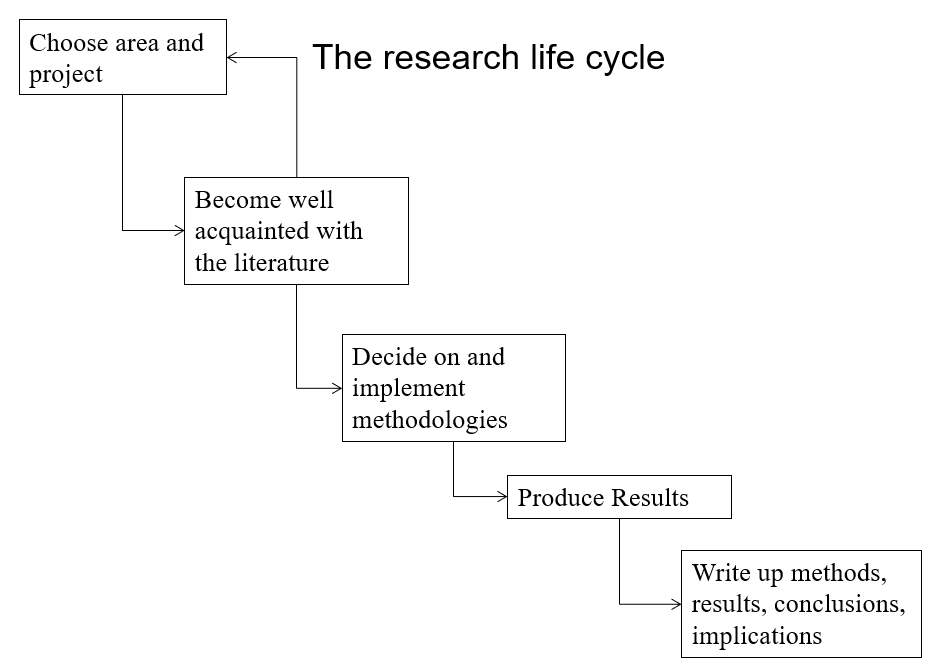

# Project Introduction

## Overview of Project
The following project which was undertaken is an online web application developed using the
Symfony 3[1] framework. Symfony is a PHP based web application framework, with a set of reusable PHP components and libraries which first published in 2005. Other web applications
which use this framework include; prestshop.com[2], sonota-project.org[3] and pimcore.com[4].
The purpose of this web application is to create an application for "Health Centre Ireland", which is targeted for users who are suffering from an illness, whether it be a physical illness
or a mental illness. The idea for this project came when reading articles about Mental Health in Ireland and how there is a lack of general knowledge in the media and throughout
the public when it comes to this affliction. So the idea of developing an app, which could both be informative, and used as an assistant to people suffering from this disease.
The idea for including other diseases came from wondering if the public had knowledge about other illness which effect people in the country, and deciding to incorporate
these other illness' into the application also. 

There are many services and charities which offer help to people suffering with these illness', and this web application will act as a hub where users can find out information relating to their illness,
find out exercises which they can partake in to potentially help or relive pain relating to their specified illness.
This application can also be used as an assistant, to potentially help anyone who suffer with these diseases' in a similar vein to previous assistant applications 
such as Pill Reminder[5] and MedCoach[6], two mobile applications for both Android and iOS which remind users when to take medication. This application will include a calendar which users can set
these kind of reminders, along with reminders of when to do exercises that can potentially relieve pain for their illness.
Users signed up to this application should also have a method of communication, which can be used to talk about their personal experiences in battling with illness, and medication
which they have taken to other users on the site.

## Project Objectives & Goals
The main objectives and goals for the project are as follows.

* Research exercise methods which can be used to relive pain of diseases and if these methods are proven to be effective

* Create a web based application "Health Centre Ireland" to assist anyone who is suffering from physical or mental illness

* Make sure that the application is ascetically pleasing, easy to use, along with having a good responsive design.

* Interaction with the app should be straight forward and every user should know exactly what to do on each page, along with what each page is for

* Implement functionality for:
    * User Registration
    * User Login
    * Routing Security
    * A Scheduler for each User
    * A Communication System
    
* Create databases which store:
    * User Information
    * Scheduler Information
    * Information Regarding User Communication

## Main Research Questions
When developing an application such as this which deals assisting a wide variety of people many questions must be asked in regard to the project,
questions such as;

* How will this application be implemented to suit each individuals affliction?

* What illnesses and afflictions will be dealt with.

* How will any difficulty that arises during the research life cycle be dealt with?

* What topics must be researched to make this application as effective as possible for its target audience?

* Why use Symfony when implementing a project like this, as opposed to another web development framework?

* Are there any other similar technologies or applications in the marketplace right now?
    * If so, research these and find out what makes these applications so successful and try to improve on them

There are multiple ways in which these topics can be researched, such as the many books and articles relating to these matters that would make for
excellent research material, some of the likes including; Cancer Fitness: Exercise Programs for Patients and Survivors by Anna L. Schwartz[7],
Overcoming Arthritis: The Complete Complementary Health Program by Dr. Sarah Brewer[8], and for implenting the project and learning about the Symfony framework;
An Introduction to Symfony 3 by Dr. Matt Smith[9].

## Technologies Used

* Software Used for Server:
    * PHP built in Web Server
    * PHP
    * MySQL Database

* Software Used for Web Application Development:
    * PHP Storm
    * HTML
    * Twig(Template Engine)
    * JavaScript
    * CSS
    * MySQL Workbench
    * Symfony 3
    
* Device Used for Testing and Demonstration
    * Lenovo Z50-75(Windows 10, 8GB of RAM, AMD FX-7500 Radeon R7 Processor)
    
All of the required software is free of charge besides PHP Storm which requires a student subscription to be free of charge,
otherwise it will cost 199€ for a year subscription. 

## Methodologies
Initially research will have to be conducted for the project in the area of Web Application Development, along with research for the
illness' which the users can sign up with, such as how many people in Ireland suffer from these illness' and the exercises that can be done to relieve pain for these.
The "Research Life Cycle"[10] will also be closely followed. The reasoning for this is so that focus is not lost at any point, and throughout the life cycle the current
step as to what must be done is always known. By following the Research Life Cycle the implementation of the project will be much easier.

The following steps of the research life cycle will be taken into consideration;

### Choose Area and Project
During this stage the project has been chosen. This includes the area of expertise for the project, in this case a web development based project.
It is here where the system will be looked at as a whole, and whether or not the project is feasible and of a suitable standard for a fourth year based project.
What type of research must be done to accomplish the project should be set out in this phase also.

### Become Well Antiquated with the Literature
At this stage all the research will be conducted and you familiarise yourself with the literature which may help with the development of the project.

### Decide on and Implement Methodologies
It is here where the project will start to be implemented and work on the project after all the necessary
research is conducted and the developer is content with what the final version of the project will be. All of the assets involved with the 
application will be analysed and then this will form the final project. 

### Produce Results
The results of the research conduct will be produced and the final idea of what the project will be should be known, and the final implementations, along with the coding of the final project
should be done here

### Write up Methods, Results, Conclusions, Implications
This is the final stage, and this will include writing up methods used from the research that has been conducted, along with the results and conclusions came
to from the research. From this point the coding, along with the deliverables of the software can be met in an effective and thorough way.

## Expected Results
Once all the research has been conducted and the software is correctly implemented, what is expected is a fully functional dynamic web application, where users can
register their illness, log in freely, be able to set reminders on exercises, or when they need to take medication, or if they have a doctors appointment. The users should also be able
to find out information about their specified illness and view a live RSS social media feed of an organisations relating to their illness. They should also be able to communicate with fellow users on the application,
through a messaging/blog type system. The user should also have wide access to a variety of information regarding their illness, such as useful websites, phone numbers, along with information
on exercises they can do to help cope with the illness or disorder they may be facing.

## Overview of Report
The contents of this report will show the research that has been conducted into this project, along a system analysis, the implementation
and design of the system, the testing phase of the system, an evaluation of the project, along with a self reflection.
The report will finish with conclusions drawn from the project and any further work which could be put into the project in the future to
improve the application. 