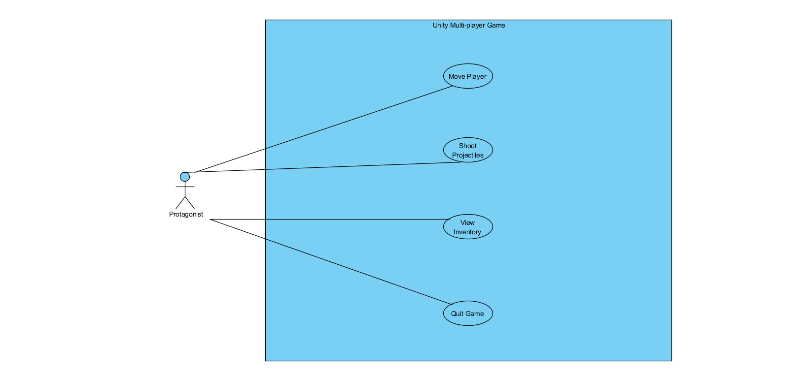
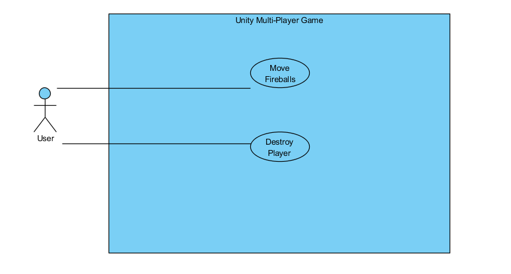
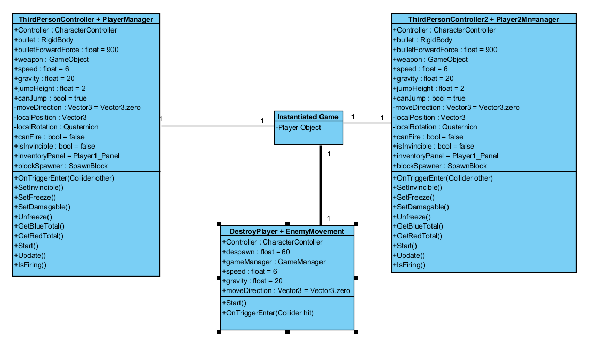
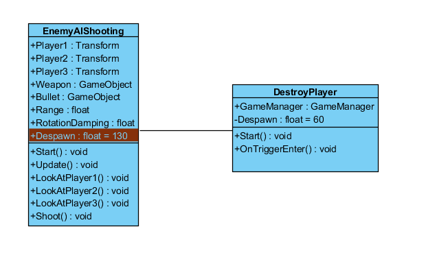

# System Analysis

## Functional Requirements

There are a number of requirements for the project. These requirements consist of:

1. There is a protagonist and antagonist

2. Users control movement of characters.

3. Users can shoot at opponents.

4. Users can view their inventory.

5. Users can quit game whenever they want.

##Use Case Diagrams
These are formal UML use case diagrams and specifications. They describe the actions that are triggered but the actors, being
the users in the system.

### Protagonist Use Case

 

#### Start Game

**Summary:** This use case describes the starting of the game by the player from a menu.

**Precondition:** The user has not yet started the game

**Triggers:** The user executes the game program.

**Course of Events**  

1. The user boots up the game.

2. The user is taken to the opening menu of the game.

3. The user presses a button which activates the code to start the level.

4. The user begins playing the game.

**Post Condition:** The game is initialised and the user starts to play.

#### Move Player

**Summary:** This use case describes the player moving the player that he is controlling.

**Precondition:** The game is initialised.

**Triggers:** The user presses or releases a movement key (or analog on controller).

**Course of Events:**

1. The user decides in which direction to move the character, whether it be horizontally or vertically.

2. Based on the input configuration set in the Unity Project settings

3. The character will move according to their speed.

4. When the user releases the movement key the character will stop and the characters position will be updated.

**Post Condition:** The character has moved accordingly.

#### Shoot Projectile

**Summary:** This use case will describe the user firing the projectile which has been picked up.

**Precondition:** The user has collected a blue freeze block and has at least one in their inventory.

**Triggers:** The user presses the fire button (being tab if using the keyboard, or the right bumper if using the controller.)

**Course of Events:**

1. The user collects a freeze block which is then added to the characters inventory.

2. The user can then attempt to fire the freeze projectile at the other players as desired.

3. If a user is hit then they are frozen in place for 3 seconds.

4. The inventory is then updated and the user will have one less freeze block.

5. If the user has zero projectiles left they can't fire.

**Post Condition:** The user has fired their projectile and will now have one less.

#### View and Update Inventory

**Summary:** The user should always be able to see their inventory and see when it updates .

**Precondition:** The user has started the game and then picks up a red or blue block.

**Triggers:** Once a red or blue block is collected the user's inventory will update and tell them which block has been 
collected.

**Course of Events:** 

1. Once the game has started the user can constantly see their inventory at the top of the screen.

2. The UI will update accordingly depending on the type of block which has been collected.

3. If a blue block has been collected, the UI will update to show one has been added to the users projectiles.

4. If a red block has been collected, the UI will update to show the user now has a shield which will last for 10 seconds.

**Post Condition:** The UI will update accordingly to the blocks collected.

#### Quit Game

**Summary:** This use case describes termination of the current game session or application.

**Precondition:** The game has been initialised.

**Triggers:** The user presses the quit button (In this case it is the escape key on the keyboard).

**Course of Events:**

1. The current game session will be closed and the user will be taken back to the main menu.

2. From the main menu the user can then quit the application if needed.

**Post Condition:** The session is terminated.

### Antagonist Use Case

#### Move Fireballs

**Summary:** This use case describes the movements made by the user controlling the antagonist (Represented by fireballs
on the map). The antagonist in this situation can only move horizontally and vertically (Using the arrow Keys). 

**Preconditions:** The game must be initialized.

**Course of Events:**

1. The user decides which way to move the fireballs in order to try and destroy the protagonists.

2. The movement is based on the input settings in Unity. In this case they are controlled by the arrow keys.

3. The fireballs move according to their set speed.

4. When the user releases the movement key the character will stop and the characters position will be updated.

5. After 60 seconds these fireballs wills disappear as the game enters phase 2.

**Post Condition:** The fireballs disappear after 60 seconds if they are unable to destroy the protagonist characters as the game
moves into its second phase.

#### Destroy Player

**Summary:** Once the protagonist character comes into contact with a fireball they are destroyed.

**Preconditions:** There must be at least 2 users, one controlling the protagonist and one controlling the antagonist.

**Course of Events:** 

1. A user is controlling the antagonist.

2. The user controlling the antagonist comes into contact with the user controlling the protagonist.

3. The protagonist game object is then destroyed.

**Post Condition:** The user controlling the protagonist character is destroyed and out of the game.

## Class Diagrams

These are static structured diagrams that are used to describe the structure within a system.

### Protagonist and Antagonist Classes

The ThirdPersonController and PlayerManager classes are responsible for all of the player one and player two's actions in game.
In this the players movement is tracked, if they fire a projectile, if they have a shield equipped etc is all implemented into these
classes.

Also located in this is diagram is the classes for the antagonist. These classes are responsible for the antagonists controls,
the movements of the antagonists and destroying the antagonist players.

### Enemy AI Classes

The EnemyAIShooting class is responsible for the turrets in game shooting at the players. The turret tracks the movements of
the characters and shoots a bullet every 2 seconds at the players last known position. The turrets will then despawn 130 seconds into the game.
The projectile fired by the turret has the DestroyPlayer script equipped. This script will destroy the player character when it comes into contact
with the player.