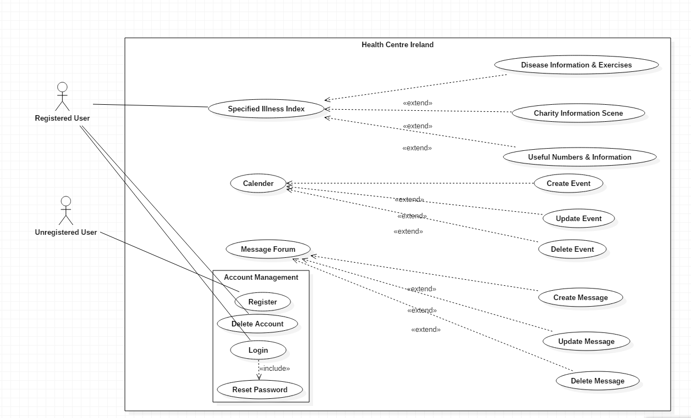

# System Analysis
Before creating anything, whether it be an artist painting a picture, or a carpenter designing a table, or a computer scientist developing
a web application, the creator must be able to visualise what they expect the finished product to look like. For a web application
such as this, this will include the likes of; how will the users be able to interact with each web-page? Will the design of the application make it easy
for users to understand? Will the application provide its overall objective, in this case informing, and helping people with a disease or illness?
This is why it's so important for a developer to be be able to distinguish and establish the functional, and non-functional requirements of their
application

## Functional Requirements
There are many functional requirements to consider when developing a web application.
For this particular web application which is designed in Symfony 3 it is important that;

* The web applications routes should all be fully functional and return a HTTP Status code of 200.

* A user should be taken to a specific route depending on the illness they have registered with.

* When a user registers their details such as username, password, email, and illness should be stored in a database.

* Certain routes on the application should be restricted to users who do not have the right credentials.

* A user should be able to create a reminder in a scheduler/calendar for a specific date and time.

* When this is done, the reminders details are stored in a database

* Once a reminder is created, the user can edit or delete the reminder.

* A user should be able to post a message to a forum.

* The messages details should be stored in a database

* The user should be able edit or delete the message posted.

* Any updates or deletions should be recognized by the database

## Non Functional Requirements
There are also a number of non-functional requirements that are necessary when designing a web application. These
usually relate to concerns regarding the user when browsing the application, such as;

* All users should be able to navigate the application with relative ease.

* The web application should have an appealing look to anyone intending to use it.

* The web application should be easily understandable in terms of what it provides to the user.

## Use Case Diagrams
This section contains a use case diagram of the system. This is what the user can expect in terms of interaction
with the web application.

### Registration
**Summary:** The user register for the web application with their specified illness, they are then assigned a role, and the database stores their information.

**Precondition:** The user must not be previously registered to the application.

**Triggers:** The users is signed up to the application and their data is stored in a database.

**Course of Events:** 

1. The user navigates to the web application.

2. The user is unregistered.

3. The user clicks the registration button and is redirected to a registration form.

4. The user enters their details and registers.

5. The users details are all stored.

6. The user can now successfully sign in and navigate the web application fully.

**Postcondition:** The user can now use the web application and find out information about their illness, along with
posting messages and setting reminders.

### Log in
**Summary:** The users signs in to their account.

**Precondition:** The user must be already registered for the application.

**Triggers:** The users details are searched in the database and if they match the user signs in successfully.

**Course of Events:** 

1. The user navigates to the web application.

2. The user clicks the sign in button and is redirected to the sign in page.

3. The user enters their username and password.

4. If the username and password combination are correct the user is successfully signed in.

**Postcondition:** The user signs in and the features of the web application are available to them.

### Delete Account
**Summary:** The users deletes their account and can no longer access the web application with that specific account.

**Precondition:** The user must have a registered account, and signed in to the web application.

**Triggers:** The users account is deleted and their information is removed from the database.

**Course of Events:**

1. The user is registered for the application

2. The user is signed in to the application

3. The user clicks the option to delete their account.

4. The users account is deleted and their details are removed from the database.

**Postcondition:** The user can no longer sign in on that account, and must create a new account if they wish to use the application.

### Reset Password
**Summary:** The user forgets their password and cannot sign in, so they must reset their password.

**Precondition:** The user must be registered for the application, but not signed in.

**Triggers:** An email is sent to the user containing a link, and from here they can reset their password

**Course of Events:**

1. The user navigates the application to the forgot password route.

2. The user enters their email address and a link containing the password reset link is sent to that email.

3. The user enters their new password.

4. The users new password replaces the old password in the database.

**Postcondition:** The users password is changed in the database and the user can sign in with their new password.

### Specified Illness Index
**Summary:** When the user signs in they are redirected to a route about their specific illness in which they signed up with.

**Precondition:** The user must be registered and signed in.

**Triggers:** Once the user specifies their illness on registration they are redirected to an index page about this specific illness.

**Course of Events:**

1. The user registers for the application.

2. The users signs in to the application.

3. The user is redirected to the illness specification index page.

**Postcondition:** The user can now look at information relating to the illness they have signed up with.

### Disease Information & Exercises
**Summary:** The user can view a series of informational articles and papers about their illness'
and information on exercises and treatments they can do to relive the illness.

**Precondition:** The user must be signed in to the application.

**Triggers:** The user can now view information regarding their specified illness.

**Course of Events:**

1. The user signs in to the web application.

2. The user is redirected to the illness specification index page.

3. The user can now access the page which displays information about their illness.

**Postcondition:** The user has access to a page which displays information about their illness and how they can combat it through exercise.
It will also include a link to a paper which gives information about the exercises and treatments the user can do regarding the illness.

### Society Information
**Summary:** The user can view information about societies which help people deal with their illness. This page will have information such as the society's number,
a link to thier website, an RSS Feed of their social media pages and a link in which the user can donate to the society if they want to.

**Precondition:** The user must be signed in to the application.

**Triggers:** The user can view information about the charity/society regarding their illness.

**Course of Events:**

1. The user signs in to the web application.

2. The user is redirected to the illness specification index page.

3. The user can now access the page which displays information about the society.

**Postcondition:** The user now has access to the page which displays information on the specific charity/society about their illness.

### Useful Numbers
**Summary:** The user can view useful numbers of helplines which they can call to talk about their illness.

**Precondition:** The user must be signed in to the application

**Triggers:** The user can view useful phone numbers for helplines in which they can talk to professionals about their illness.

**Course of Events:**

1. The user signs in to the web application.

2. The user is redirected to the illness specification index page.

3. The user can now access the page which displays all the useful helpine numbers.

**Postcondition:** The user can view information about the helplines regarding their specific illness.

### Calendar
**Summary:** The user can check their reminders in their own calendar.

**Precondition:** The user must be signed in.

**Triggers:** The user is taken to the calendar page in the application

**Course of Events:**

1. The user signs in to the web application.

2. The user then navigates to the calendar page of the web application.

**Postcondition:** The user views their calendar and can set reminders in the calendar.

### Create Event
**Summary:** The user can set a reminder or an event in their calendar. Whether it be to take part
in an exercise, or take a prescribed medication, or if they have a medical appointment.

**Precondition:** The user must be signed in and on the calendar page.

**Triggers:** A reminder is then set for the user and it is stored in the database.

**Course of Events:** 

1. The user signs in to the application.

2. The user navigates to the calendar page of the web application.

3. The user sets a reminder in their calendar.

4. The reminder appears in the users calendar and is stored in the database.

**Postcondition:** A reminder is then set for the user which they can see on their calendars view.

### Update Event
**Summary:** Once a reminder is set in the users calendar the user can then update the reminder as they see fit.

**Precondition:** The users reminder must already be set in the calendar.

**Triggers:** The users reminder is updated and the details in the database are then changed to the new reminder.

**Course of Events:**

1. The user signs in to the application.

2. The user navigates to the calendar page of the application.

3. The user sets a reminder in their calendar.

4. The reminder appears in the users calendar and its information is stored in the database.

5. The user then updates the reminder to be different.

6. The reminders information is then changed on the calendars view and in the database.

**Postcondition:** The event is then updated in the calendars view and the information which has been stored in the database
is updated.

### Delete Event
**Summary:** Once a reminder is set in the users calendar the user can then delete the reminder if they want to.

**Precondition:** The users reminder must already be set in the calendar.

**Triggers:** The reminder is deleted and removed from the view and the database.

**Course of Events:**

1. The user signs in to the application.

2. The user navigates to the calendar page of the application.

3. The user sets a reminder in their calendar.

4. The reminder appears in the users calendar and its information is stored in the database.

5. The user can then delete the reminder.

6. The reminder is then removed from the calendars view and its information is removed from the database.

**Postcondition:** The reminder is removed and can no longer be seen in the view.

### Message Forum
**Summary:** The user views the messages which have been written and posted by other users.

**Precondition:** The user must be signed in.

**Triggers:** The user views a series of messages which they can post and view other users messages.

**Course of Events:**

1. The user signs in to the web application

2. The user navigates to the message forum section of the web application.

**Postcondition:** The user can view and post messages and communicate with other people on the web application.

### Create Message
**Summary:** The user posts a message to the forum.

**Precondition:** The user must be signed in and on the message forum web page of the application.

**Triggers:** A new message is posted to the message board. The messages information is then stored in a database.

**Course of Events:**

1. The user signs in to the web application.

2. The user navigates to the message forum page of the application.

3. The user posts a message in the forum.

4. A new message appears in the message forum which other users can then see and its information
is stored in the database.

**Postcondition:** The user posts their own personalised message in the message board which can then be seen by other users.
### Update Message
**Summary:** The user updates their previously posted message.

**Precondition:** The user must be signed in and already have previously posted a message.

**Triggers:** The message is changed and updated, and the messages information in the database is also updated.

**Course of Events:**

1. The user signs in to the web application.

2. The user navigates to the message forum of the application.

3. The user posts a message in the forum.

4. The message appears in the forum and its information is stored in the database.

5. The user updates the message and the changed message appears in the forum. The message information
in the database is also updated.

**Postcondition:** The message is changed and updated in the forum.

### Delete Message
**Summary:** The user deletes the message which was previously posted.

**Precondition:** The user must be signed in and have already previously posted a message.

**Triggers:** The message is deleted from the message forums view and deleted from the database.

**Course of Events:**

1. The user signs in to the web application.

2. The user navigates to the message forum of the application.

3. The user posts a message in the forum.

4. The message appears in the forum and its information is stored in the database.

5. The user deletes the message from the forum and its information is removed from the database.

**Postcondition:** The message is deleted from the forum and can no longer be seen.

## Class Diagrams

