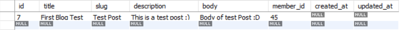
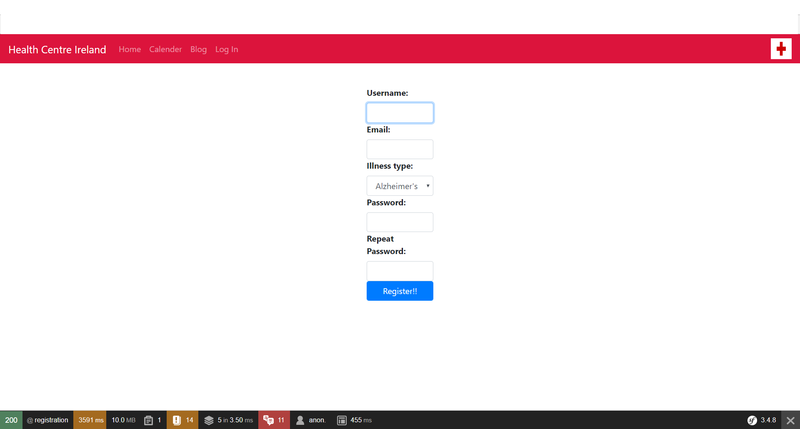
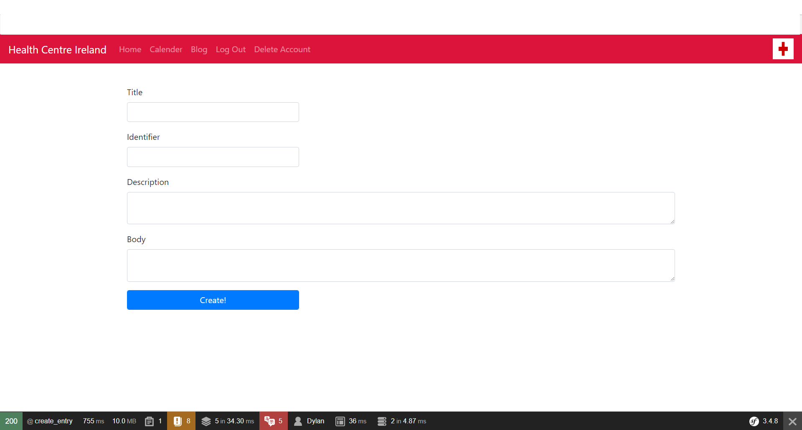

# Implementation and Design of System

## Overview of Implementations
The system was implemented in Symfony 3, a web framework designed to speed up the creation of web applications and replace
certain repetitive coding tasks.  It eliminates these coding tasks because the developer can reuse components and it can make development
less daunting for the developer by not having to redevelop basic, generic features, such as making user forms. Symfony also certain tools which can 
improve productivity for the user. The Web Toolbar Debugger being the main feature which does this. This tells the developer detailed technical information about each page and
request made on the application. This makes it easier to track errors, such as the HTTP request code. If an error is detected Symfony will return a detailed error page outlining what the error is and this will be shown in the toolbar also.
The toolbar also contains the users current credentials, the time it took the page to execute and render and the current page which is being displayed.


Symfony was installed using "Composer"[23], a tool used for dependency management in PHP. It allows the developer to declare libraries which the developers project will depend on.
Symfony was than created by issuing the command 
````
composer create-project symfony/website-skeleton:^3.4 HealthCentreIreland
````

The project also used databases made in MySQL Workbench 6.3[24]. These databases were used to store various bits of information,
be it the users info, the reminders made in the scheduler, and the messages posted. As Symfony does not provide a component which works directly with databases, the third party library Doctrine was used.

Doctrine was installed using the command 

````
composer require-doctrine
````

From here all the necessary components were installed and the project could start being worked on.

## Implementation Components

There are several components which needed to be implemented in order to provide a fully functional web application which provides its purpose.
These included;

* Database Entities.

* User Registration

* User Login

* Delete User

* User Calendar

* User Blog/Messaging System

* Implanting Routes based on user credentials.

### Database Entities
First, databases needed to be set up which dealt with storing the users information, along with the calendar information and 
the posted messages information. To first set up the databases the parameters.yml file in the app/config folder with the database settings which are
specific to the developers environment. The parameters.yml file in this specific project looked like this.

````
parameters:
    database_host: 127.0.0.1
    database_port: 3306
    database_name: member_form
    database_user: root
    database_password: dbpassword
    mailer_transport: smtp
    mailer_host: 127.0.0.1
    mailer_user: null
    mailer_password: null
    secret: ThisTokenIsNotSoSecretChangeIt
````

Once these settings were in place the database was created using the command 

````
php bin/console doctrine:database:create
````

Once this is done the table must be created. This table was created with the title of member and the columns being the details which the user must input
at a later stage, these being; id, username, email, password and categorys. 

The DDL(Data Definition Language) looked like this for the setup of this table:

````
CREATE TABLE `member` (
  `id` int(11) NOT NULL AUTO_INCREMENT,
  `username` varchar(255) COLLATE utf8_unicode_ci NOT NULL,
  `email` varchar(255) COLLATE utf8_unicode_ci NOT NULL,
  `password` varchar(64) COLLATE utf8_unicode_ci NOT NULL,
  `categorys` varchar(255) COLLATE utf8_unicode_ci NOT NULL,
  PRIMARY KEY (`id`),
) ENGINE=InnoDB AUTO_INCREMENT=45 DEFAULT CHARSET=utf8 COLLATE=utf8_unicode_ci
````

Once the table  was created it looked like this:


Each time a database is created an ORM file for the particular database will be setup. 

The command to generate an ORM file is

````
php bin/console doctrine:mapping:import --force AppBundle yml
````

This will generate an ORM file for the Member table which will look like this:

````
AppBundle\Entity\Member:
    type: entity
    table: member
    indexes:
        memberType_idx:
            columns:
                - categorys
    id:
        id:
            type: integer
            nullable: false
            options:
                unsigned: false
            id: true
            generator:
                strategy: IDENTITY
    fields:
        username:
            type: string
            nullable: false
            length: 255
            options:
                fixed: false
        email:
            type: string
            nullable: false
            length: 255
            options:
                fixed: false
        password:
            type: string
            nullable: false
            length: 64
            options:
                fixed: false
        categorys:
            type: string
            nullable: false
            length: 255
            options:
                fixed: false
    lifecycleCallbacks: {  }

````

Now that the database has been connected and setup and an ORM file has been generated, a Doctrine entity can be created. This
is an object with an $id property in the database. 

The member entity is then generated using the command:

````
php bin/console doctrine:generate:entities AppBundle
````

Once generated the entity class looks like this:

Member.php
````
<?php

namespace AppBundle\Entity;

use Doctrine\ORM\Mapping as ORM;

/**
 * Member
 *
 * @ORM\Table(name="member")
 * @ORM\Entity(repositoryClass="AppBundle\Repository\MemberRepository")
 */
class Member implements UserInterface, \Serializable
{
    /**
     * @var int
     *
     * @ORM\Column(name="id", type="integer")
     * @ORM\Id
     * @ORM\GeneratedValue(strategy="AUTO")
     */
    protected $id;

    /**
     *
     * @var string
     * @ORM\Column(name="username", type="string", length=255, unique=true)
     *
     */
    protected $username;

    /**
     *
     * @var string
     * @ORM\Column(name="email", type="string", length=255, unique=true)
     *
     */
    protected $email;

    /**
     * @var string
     * @ORM\Column(name="categorys", type="string", length=255)
     */
    protected $categorys;


    protected $plainPassword;


    /**
     * @var string
     *
     * @ORM\Column(name="password", type="string", length=64)
     */
    protected $password;


    /**
     * Get id
     *
     * @return int
     */
    public function getId()
    {
        return $this->id;
    }


    /**
     * Set username
     *
     * @param string $username
     *
     * @return Member
     */
    public function setUsername($username)
    {
        $this->username = $username;

        return $this;
    }

    /**
     * Get username
     *
     * @return string
     */
    public function getUsername()
    {
        return $this->username;
    }

    /**
     * Set email
     *
     * @param string $email
     *
     * @return Member
     */
    public function setEmail($email)
    {
        $this->email = $email;

        return $this;
    }

    /**
     * Get email
     *
     * @return string
     */
    public function getEmail()
    {
        return $this->email;
    }

    /**
     * Set password
     *
     * @param string $password
     *
     * @return Member
     */
    public function setPassword($password)
    {
        $this->password = $password;

        return $this;
    }

    /**
     * Get password
     *
     * @return string
     */
    public function getPassword()
    {
        return $this->password;
    }

````

To transform this into a symfony user object on the application two interfaces must first be implemented. These two
interfaces being:

````
implements UserInterface, \Serializable
````

and:

````
use Symfony\Component\Security\Core\User\UserInterface;
````

By implementing these two interfaces more methods must be added to the Member entity. These methods being the
"getRoles()", getSalt(), and eraseCredentials() method. The getRoles() method will return an arrays of strings, these strings
being the users role within the application. For example in this web application the roles given to users are based on their registered illness, such as;
"ROLE_CANCER", "ROLE_DEPRESSION", "ROLE_DIABETES", "ROLE_ALZHEIMERS" and "ROLE_ARTHRITIS".

To assign the user the correct role, the function .strtoupper() is used to read in the category which the users signs up with and converts the string to uppercase.
This is preceded by the string 'ROLE_' meaning that the users category in the database is added to the end of this, returning the role of 'ROLE_ARTHRITIS'
for example. 

````
    public function getRoles()
    {
            return[
                'ROLE_' . strtoupper($this->categorys)
            ];
    }
````

The getSalt() method will hash and encrypt passwords. But if a password is being hashed using bcrypt as it will be in this project
there is no need to use the salt method, and it can return null. The eraseCredentials() method will remove any sensitive data from the Member object.
The purpose of implementing the "Serializable" method is so that the user only has to log in once for a pre-determined length of time, as opposed to having
to log in every time a new request is made on the application. Creating a user and how their information is added to the database will be further explained in section 4.2.2.

Once the member table is created it is necessary to also create a table for both both the scheduler and the schedulers category. For the scheduler a table with all the necessary information
regarding the users set reminder must be taken into account. The table was called appointments and was given 5 fields all relating to the
reminders set by the user, these being; id, title, description, start_date, end_date and category. 

The DDL for the following table was;

````
CREATE TABLE `appointments` (
  `id` bigint(20) NOT NULL AUTO_INCREMENT,
  `title` varchar(255) NOT NULL,
  `description` text,
  `start_date` datetime NOT NULL,
  `end_date` datetime NOT NULL,
  `category` bigint(20) DEFAULT NULL,
  PRIMARY KEY (`id`),
  KEY `IDX_6A41727A64C19C1` (`category`),
  CONSTRAINT `FK_6A41727A64C19C1` FOREIGN KEY (`category`) REFERENCES `categories` (`id`)
) ENGINE=InnoDB AUTO_INCREMENT=38 DEFAULT CHARSET=utf8
````

Once this table has been created it looks like:


The category field is a foreign key which references another table called category. This will further be explained in section 4.2.4.
It is used to display a category in which the user can set their reminder for, being "Medical Reminder", "Exercise Reminder" and "Medication Reminder"".
 
 The DDL for this looks like;

````
CREATE TABLE `categories` (
  `id` bigint(20) NOT NULL AUTO_INCREMENT,
  `name` varchar(255) NOT NULL,
  PRIMARY KEY (`id`)
) ENGINE=InnoDB AUTO_INCREMENT=4 DEFAULT CHARSET=utf8
````

Once the table is created it looks like:


Once both of these tables have been created both ORM files and entities were generated for each of them using the same command as before. Both the ORM files and the entities can be viewed in the appendix of this paper.

The final table which needed to be created was one which dealt with posting messages within a blog. For this table it was necessary to store all the information
regarding the posted message. There are 8 field names in total. These being; id, title, slug, description, body, member_id, created_at and updated_at.
The member_id field is a foreign key which references the member table and the column of id. The reason why will be further explained in section 4.2.5.

The DDL for the following table was: 

````
CREATE TABLE `blog_post` (
  `id` int(11) NOT NULL AUTO_INCREMENT,
  `title` varchar(255) NOT NULL,
  `slug` varchar(255) NOT NULL,
  `description` varchar(2000) NOT NULL,
  `body` text,
  `member_id` int(11) DEFAULT NULL,
  `created_at` datetime DEFAULT NULL,
  `updated_at` datetime DEFAULT NULL,
  PRIMARY KEY (`id`),
  UNIQUE KEY `slug_UNIQUE` (`slug`),
  KEY `blogForeignKey_idx` (`member_id`),
  CONSTRAINT `blogForeignKey` FOREIGN KEY (`member_id`) REFERENCES `member` (`id`) ON DELETE CASCADE ON UPDATE NO ACTION
) ENGINE=InnoDB AUTO_INCREMENT=8 DEFAULT CHARSET=utf8
````

Once the table is created it will look like.



An ORM file and an entity is also generated for this table which can be viewed in the appendix of this paper.

### User Registration

Once all the necessary databases are set up and the entities are generated it is time to move on to creating a registration controller for the user which will store
users information into the database. The first thing to do is to change the entity class slightly to allow for a bcrypt encrypted password in the password field so the users
plain password is not stored here. Instead of this, all future user requests to log in to the application will involve running the bcrypt process and comparing that value to the
users submitted plain password. If the two match, this means that the right password has been submitted. This means that a temporary holding area to store the users plain password must be created.
A new class property is added to the Memeber.php entity class to hold this plain password

````
private $plainPassword;

/**
* @return String
*/
public function getPlainPassword()
{
    return $thid->plainPassowrd;
}

/**
*@param string $plainPassowrd
*@return Member
*/
public function setPlainPassword($plainPassword)
{
    $this->plainPassword = $plainPassword;
    
    return $this;
}
````

After this is done an encoder must be configured in security.yml for users passwords, for which the bcrypt algorithm will be used.
The member entity is then added to encoders using the bcrypt algorithm and now all passwords in this entity will be encrypted.

````
    encoders:
        Symfony\Component\Security\Core\User\User:
            algorithm: bcrypt
        AppBundle\Entity\Member:
            algorithm: bcrypt
            
    providers:
        in_memory:
            memory:
                users:
                    admin:
                        password: $2y$13$sBG1nMvGxgY.AprC/tYl5ecuDvxT66bYNRrdX0zAyQCqQiUX./fqS
                        roles: 'ROLE_ADMIN'
````

Once this is done, the next step is to generate a registration form. This will be talked about further in section 4.3 of this paper.
Once the registration form is generated, a controller must be made which handles all routes in dealing with registration and form submission.
First a function which renders the registration form page must be created.
What this function does it will redirect any user who has the credentials of "ROLE_ARTHRITIS", "ROLE_CANCER", "ROLE_DIABETES", "ROLE_DEPRESSION" OR "ROLE_ALZHEIMER"
back to their specified index route and any anonymous user will be redirected to
to the twig template page "register.html.twig". This page creates the view for the form which is passed through the key
'registration_form'.

````
   /**
     * @Route("/register", name="registration")
     * @return \Symfony\Component\HttpFoundation\Response
     * @throws \LogicException
     */
    public function registerAction(Request $request)
    {
        $member = new Member();

        $form = $this->createMemberRegistrationForm($member);


        if($this->container->get('security.authorization_checker')->isGranted('ROLE_ARTHRITIS'))
        {
            return $this->redirectToRoute('arthritis');
        }

        else if ($this->container->get('security.authorization_checker')->isGranted('ROLE_CANCER'))
        {
            return $this->redirectToRoute('cancer');
        }

        else if ($this->container->get('security.authorization_checker')->isGranted('ROLE_DIABETES'))
        {
            return $this->redirectToRoute('diabetes');
        }

        else if ($this->container->get('security.authorization_checker')->isGranted('ROLE_DEPRESSION'))
        {
            return $this->redirectToRoute('depression');
        }

        else if ($this->container->get('security.authorization_checker')->isGranted('ROLE_ALZHEIMER'))
        {
            return $this->redirectToRoute('alzheimers');
        }

        return $this->render('registration/register.html.twig',[
            'registration_form' => $form->createView(),

        ]);
    }
````

The next function used in this class is the handleFormSubmission().
This function deals with the submission of the form. If the form is not successfully submitted the user is redirected
back to the registration page. Once the request is handled the password is then encoded, and the value of the $member entity is set.
Then the Doctrine entity manager is used to save this to the database. An instance of UsernamePasswordToken is then used, this takes
4 arguments 3 of which are mandatory. These arguments are an object which represents the user, the users credentials, a provider key which is called after the firewall, in this case the firewall is called main,
so the value used for the provider key is 'main'. Then the role of the user is returned. The final lines of code then check the
users role and will redirect the user accordingly. The user is now successfully registered

````
    /**
     * @param Request $request
     * @Route("/registration-form-submission", name="handle_registration_form_submission")
     * @Method("POST")
     * @return \Symfony\Component\HttpFoundation\RedirectResponse|\Symfony\Component\HttpFoundation\Response
     * @throws \LogicException
     * @throws \InvalidArgumentException
     */
    public function handleFormSubmissionAction(Request $request)
    {
        $member = new Member();

        $form = $this->createMemberRegistrationForm($member);

        $form->handleRequest($request);

        if (! $form->isSubmitted() || ! $form->isValid()) {
            return $this->render('registration/register.html.twig',[
                'registration_form' => $form->createView(),

            ]);
        }

        $password = $this->get('security.password_encoder')
            ->encodePassword($member, $member->getPlainPassword());

        $member->setPassword($password);

        $em = $this->getDoctrine()->getManager();


        $em->persist($member);
        $em->flush();

        $token = new UsernamePasswordToken(
            $member,
            $password,
            'main',
            $member->getRoles()
        );

        $this->get('security.token_storage')->setToken($token);
        $this->get('session')->set('_security_main', serialize($token));

        $this->addFlash('success', 'You are now registered');

        if($this->container->get('security.authorization_checker')->isGranted('ROLE_ARTHRITIS'))
        {
            return $this->redirectToRoute('arthritis');
        }

        else if ($this->container->get('security.authorization_checker')->isGranted('ROLE_CANCER'))
        {
            return $this->redirectToRoute('cancer');
        }

        else if ($this->container->get('security.authorization_checker')->isGranted('ROLE_DIABETES'))
        {
            return $this->redirectToRoute('diabetes');
        }

        else if ($this->container->get('security.authorization_checker')->isGranted('ROLE_DEPRESSION'))
        {
            return $this->redirectToRoute('depression');
        }

        else if ($this->container->get('security.authorization_checker')->isGranted('ROLE_ALZHEIMER'))
        {
            return $this->redirectToRoute('alzheimers');
        }
    }
````

### User Login
Once a user is registered and wants to login the user needs to be loaded from the database. This is done in the security.yml file.
First what must be done in the providers section of the security.yml file a db_provider must be added which then loads in the users
from an entity. A chain provider must then be built which will look through both the db_provider and the in_memory provider until it finds the matching user.
The property which is being looked for in the provider in this case is the username, in the class AppBundle:Member. Once this is found and the password is correct the user will be logged in.

````
    providers:
      chain_provider:
        chain:
          providers:
            - in_memory
            - db_provider
      in_memory:
            memory:
                users:
                    admin:
                        password: $2y$13$sBG1nMvGxgY.AprC/tYl5ecuDvxT66bYNRrdX0zAyQCqQiUX./fqS
                        roles: 'ROLE_ADMIN'
      db_provider:
        entity:
          class: AppBundle:Member
          property: username
````

When a user can be loaded from the database a login form must be created so that the user can log in with their correct credentials.
This will be talked about further in section 3.4

The next function which must be coded is the route which renders the login page. If a user is granted any role they will not be able to access the login page as
they are already logged in. So they will be redirected to their specified illness page, but otherwise, the route /login will render
the twig template of 'security/login.html.twig'.

````
    /**
     * @Route("/login", name="login")
     */
    public function loginAction()
    {
        if($this->container->get('security.authorization_checker')->isGranted('ROLE_ARTHRITIS'))
        {
            return $this->redirectToRoute('arthritis');
        }

        else if ($this->container->get('security.authorization_checker')->isGranted('ROLE_CANCER'))
        {
            return $this->redirectToRoute('cancer');
        }

        else if ($this->container->get('security.authorization_checker')->isGranted('ROLE_DIABETES'))
        {
            return $this->redirectToRoute('diabetes');
        }

        else if ($this->container->get('security.authorization_checker')->isGranted('ROLE_DEPRESSION'))
        {
            return $this->redirectToRoute('depression');
        }

        else if ($this->container->get('security.authorization_checker')->isGranted('ROLE_ALZHEIMER'))
        {
            return $this->redirectToRoute('alzheimers');
        }

            return $this->render('security/login.html.twig',[
            ]);
    }
````

The next challenge is where will the user be redirected once they login? The user will be redirected the route /signin once they are logged in.
This route will render a page based on the users role within the application.

````
    /**
     * @Route("/signin", name="signin")
     */
    public function signinAction()
    {
        if($this->container->get('security.authorization_checker')->isGranted('ROLE_ARTHRITIS'))
        {
            return $this->redirectToRoute('arthritis');
        }

        else if ($this->container->get('security.authorization_checker')->isGranted('ROLE_CANCER'))
        {
            return $this->redirectToRoute('cancer');
        }

        else if ($this->container->get('security.authorization_checker')->isGranted('ROLE_DIABETES'))
        {
            return $this->redirectToRoute('diabetes');
        }

        else if ($this->container->get('security.authorization_checker')->isGranted('ROLE_DEPRESSION'))
        {
            return $this->redirectToRoute('depression');
        }

        else if ($this->container->get('security.authorization_checker')->isGranted('ROLE_ALZHEIMER'))
        {
            return $this->redirectToRoute('alzheimers');
        }
    }
````

### Log Out
If a user wants to log out of the web application first a route for logout must be configured.

````
    /**
     * @Route("/logout", name="logout")
     * @throws \RuntimeException
     */
    public function logoutAction()
    {
        throw new \RuntimeException('Logout');
    }
````
Then inside the firewalls main section of security.yml a logout parameter must be added and set to true.

````
    firewalls:
        main:
            pattern: ^/
            provider: chain_provider
            form_login:
                login_path: login
                failure_path: login
                check_path: login
                success_handler: crv.authentication.success_handlers
                success_handler: crv.authentication.failure_handlers
            logout: true
````

### Delete User
Deleting a user is similar to registering a user. The function gets the current user that is signed in and instead of the user being added to the database using '$em->persist($member);'
the user is removed instead using 'em->remove($user);'. The users role is then defined, the users token is set to null and the users details are removed from the database. The user
is then redirected to the login page.

````
    /**
     * @Route("/deleteuser", name="deleteuser")
     */
    public function deleteUser(Request $request)
    {

        $user = $this->getUser();
        $member = new Member();

        $password = $this->get('security.password_encoder')
            ->encodePassword($member, $member->getPlainPassword());

        if($this->container->get('security.authorization_checker')->isGranted('ROLE_ARTHRITIS'))
        {

            $token = new UsernamePasswordToken(
                $member,
                $password,
                'main',
                $member->getRoles()
            );

            $this->get('security.token_storage')->setToken(null);

            $em = $this->getDoctrine()->getManager();
            $em->remove($user);
            $em->flush();

            return $this->redirectToRoute('login');
        }
````

### User Calendar/Scheduler
There were a number of libraries which were needed to create the scheduler for this application. The first of these
libraries being the dhtmlx[25] scheduler library. This library came as a zipped file which was downloaded and then imported into the project.
The moment.js[26] library was used to format the date. The final library which was used was the jQuery AJAX library to submit reminders into the view.
All the databases, entities and ORM files were already previously implemented for the scheduler. So the next was to implement the schedulers controllers and its routes.
There are only 4 routes for the scheduler, all of these routes can be accessed at the route /scheduler.
The routing.yml file was modified to register a routing file which will then handle the routes for the calendar.

````
app_scheduler:
    resource: "@AppBundle/Resources/config/routing/scheduler.yml"
    prefix:   /scheduler
````

The new routing file is located in AppBundle/Resources/config/routing/scheduler.yml, with each route will be handled by the SchedulerController.php class.
The following routes in this yml file will create, delete and modify the reminders via jQuery AJAX.

````
# app/config/routing.yml

scheduler_create:
    path:      /appointment-create
    defaults:  { _controller: AppBundle:Scheduler:create }
    methods:  [POST]

scheduler_update:
    path:      /appointment-update
    defaults:  { _controller: AppBundle:Scheduler:update }
    methods:  [POST]

scheduler_delete:
    path:      /appointment-delete
    defaults:  { _controller: AppBundle:Scheduler:delete }
    methods:  [DELETE]
````

Next a controller must be created to handle the routes for the scheduler.
The first function renders the scheduler, along with retrieving the entity manager and getting the repository for both the appointments and the categories tables in the database.
A JSON structure must also be generated from the appointments to render at the start of the scheduler.
A JSON structure must also be generated the categories repository so they categories that the user can select will be rendered inside a select option on the lightbox.
The scheduler is then rendered.

````
    /**
     * @Route("/scheduler", name="scheduler")
     */
    public function indexAction()
    {
        $em = $this->getDoctrine()->getManager();

        $repositoryAppointments = $em->getRepository("AppBundle:Appointments");

        $repositoryCategories = $em->getRepository("AppBundle:Categories");

        $appointments = $repositoryAppointments->findAll();

        $formatedAppointments = $this->formatAppointmentsToJson($appointments);

        $categories = $repositoryCategories->findAll();

        $formatedCategories = $this->formatCategoriesToJson($categories);

        return $this->render("scheduler/scheduler.html.twig", [
            'appointments' => $formatedAppointments,
            'categories' => $formatedCategories,
        ]);
    }
````

The next function after this handles the creation of the appointment. It uses the date format use by the Moment.js in the view.
The appointment entity is then created and the fields values are set. The appointment is then created and saved to the database.

````
   /**
     * Creates reminder in the database.
     */
    public function createAction(Request $request){
        $em = $this->getDoctrine()->getManager();
        $repositoryAppointments = $em->getRepository("AppBundle:Appointments");

        $format = "d-m-Y H:i:s";

        $appointment = new Appointment();
        $appointment->setTitle($request->request->get("title"));
        $appointment->setDescription($request->request->get("description"));
        $appointment->setStartDate(
            \DateTime::createFromFormat($format, $request->request->get("start_date"))
        );
        $appointment->setEndDate(
            \DateTime::createFromFormat($format, $request->request->get("end_date"))
        );

        $repositoryCategories = $em->getRepository("AppBundle:Categories");

        $appointment->setCategory(
            $repositoryCategories->find(
                $request->request->get("category")
            )
        );

        // Create appointment
        $em->persist($appointment);
        $em->flush();

        return new JsonResponse(array(
            "status" => "success"
        ));
    }
````

The next function is used to handle any updates made to the appointment. If the appointment being updated does not exist an error is returned.
The rest of the function then carries out like the createAction() function does.

````
   /**
     * Updates reminder in the database.
     */
    public function updateAction(Request $request){
        $em = $this->getDoctrine()->getManager();
        $repositoryAppointments = $em->getRepository("AppBundle:Appointments");

        $appointmentId = $request->request->get("id");

        $appointment = $repositoryAppointments->find($appointmentId);

        if(!$appointment){
            return new JsonResponse(array(
                "status" => "error",
                "message" => "The appointment you tried to update does not exist?"
            ));
        }

        $format = "d-m-Y H:i:s";

        $appointment->setTitle($request->request->get("title"));
        $appointment->setDescription($request->request->get("description"));
        $appointment->setStartDate(
            \DateTime::createFromFormat($format, $request->request->get("start_date"))
        );
        $appointment->setEndDate(
            \DateTime::createFromFormat($format, $request->request->get("end_date"))
        );

        $repositoryCategories = $em->getRepository("AppBundle:Categories");

        $appointment->setCategory(
            $repositoryCategories->find(
                $request->request->get("category")
            )
        );

        // Update appointment
        $em->persist($appointment);
        $em->flush();

        return new JsonResponse(array(
            "status" => "success"
        ));
    }
````

A function must also be created to delete appointments from the database.
Like before if the appointment does not exist an error message is returned. The appointment is then removed from the database.

````
    /**
     * Deletes reminder from the database
     */
    public function deleteAction(Request $request){
        $em = $this->getDoctrine()->getManager();
        $repositoryAppointments = $em->getRepository("AppBundle:Appointments");

        $appointmentId = $request->request->get("id");

        $appointment = $repositoryAppointments->find($appointmentId);

        if(!$appointment){
            return new JsonResponse(array(
                "status" => "error",
                "message" => "The appointment you tried to delete does not exist?"
            ));
        }

        $em->remove($appointment);
        $em->flush();

        return new JsonResponse(array(
            "status" => "success"
        ));
    }
````

The final function which is then created returns a JSON string of the reminder which is then rendered on the calendar.
The dates must follow the format already set by the Moment.js library.

````
    private function formatAppointmentsToJson($appointments){
        $formatedAppointments = array();

        foreach($appointments as $appointment){
            array_push($formatedAppointments, array(
                "id" => $appointment->getId(),
                "description" => $appointment->getDescription(),
                "text" => $appointment->getTitle(),
                "start_date" => $appointment->getStartDate()->format("Y-m-d H:i"),
                "end_date" => $appointment->getEndDate()->format("Y-m-d H:i"),
            ));
        }

        return json_encode($formatedAppointments);
    }
````

The same must be done then for the category which will return a json string based on the data in the repository.

````
    private function formatCategoriesToJson($categories){
        $formatedCategories = array();

        foreach ($categories as $category){
            array_push($formatedCategories, array(
                "key" => $category->getId(),
                "label" => $category->getName()
            ));
        }

        return json_encode($formatedCategories);
    }
````

Client side logic must the be written. The user will be allowe to create their appointments through the default Lightbox of the dhtmlx scheduler.
What must be written is the way in which the scheduler will behave. The xml_date format must be provided, while the rest is optional.
Once the date is set the scheduler is set so that it starts at midnight, and ends at 24:00 hours. Meaning the time in which the user
can set reminders is between 00:00 and 23:55. The details of the event are also shown on creation

````
scheduler.config.xml_date="%Y-%m-%d %H:%i";
scheduler.config.first_hour = 0;
scheduler.config.last_hour = 24;
scheduler.config.limit_time_select = true;
scheduler.config.details_on_create = true;
````

In the next section event creation is disabled on a single click and if a user wants to create and event they must double click.
The user can also only set a maximum of 5 events each month before they must delete one.

````
scheduler.config.select = false;
scheduler.config.details_on_dblclick = true;
scheduler.config.max_month_events = 5;
scheduler.config.resize_month_events = true;
````

The Lightbox form sections are created next. With the names of "Title", "Description", "Type of Reminder" and "Time".
They are also given heights of 30, 50, 40 and 30 respectively. The Type Of Reminder options are called from the Category table.

````
scheduler.config.lightbox.sections = [
    {name:"Title", height:30, map_to:"text", type:"textarea"},
    {name:"Description", height:50, map_to:"description", type:"textarea"},
    {name: "Type of Reminder", options: window.GLOBAL_CATEGORIES, height:40, map_to: "category", type: "select"},
    {name:"Time", height:30, type:"time", map_to:"auto"}
];
````

Next custom settings are setup for the calendar, such as the element where the scheduler will be started.
The date where the scheduler should be started and which mode it should start on. In this case the scheduler will start on the current day,
and will start on the mode week, meaning it will show the current week by default.

````
var initSettings = {
    elementId: "scheduler_element",
    startDate: new Date(),
    mode: "week"
};
````

Next a funtion must be created which formats the events to the expected format in the server side.

````
/*
 * @param {*} id
 * @param {*} useJavascriptDate
 */
function getExpectedFormat(id, useJavascriptDate){
    var event;

    // If the ID already exists on an event don't search for it and use it
    if(typeof(id) == "object"){
        event = id;
    }else{
        event = scheduler.getEvent(parseInt(id));
    }

    if(!event){
        console.error("This ID does not exist " + id);
        return false;
    }

    var start , end;

    if(useJavascriptDate){
        start = event.start_date;
        end = event.end_date;
    }else{
        start = moment(event.start_date).format('DD-MM-YYYY HH:mm:ss');
        end = moment(event.end_date).format('DD-MM-YYYY HH:mm:ss');
    }

    return {
        id: event.id,
        start_date : start,
        end_date : end,
        description : event.description,
        title : event.text,
        category: event.category
    };
}

````

Next the handlers for the events must be attached. These being the create, update and delete handlers.
If the appointment is successfully created an alert will tell the user their appointment has been created, otherwise they will get an error message.
It is important to update the id of the schedulers appointment with the ID of the database, so the appointment can be edited.

````
/**
 * Calendar Create Event
 */
scheduler.attachEvent("onEventAdded", function(id,ev){
    var schedulerState = scheduler.getState();

    $.ajax({
        url:  window.GLOBAL_SCHEDULER_ROUTES.create,
        data: getExpectedFormat(ev),
        dataType: "json",
        type: "POST",
        success: function(response){
            scheduler.changeEventId(ev.id , response.id);

            alert('Appointment '+ev.text+ " has been created! Good Luck!");
        },
        error:function(error){
            alert('Error: The following appointment '+ev.text+ 'refresh and try again or report to an admin');
            console.log(error);
        }
    });
});
````

If a user successfully updates an event they will get alert saying that the appointment has been successfully updated, otherwise
they will get an error message.

````
/**
 * Calendar Update Event
 */
scheduler.attachEvent("onEventChanged", function(id,ev){
    $.ajax({
        url:  window.GLOBAL_SCHEDULER_ROUTES.update,
        data: getExpectedFormat(ev),
        dataType: "json",
        type: "POST",
        success: function(response){
            if(response.status == "success"){
                alert("Appointment Updated!");
            }
        },
        error: function(error){
            alert("Error: Cannot save changes, refresh and try again or report to Admin");
            console.error(error);
        }
    });

    return true;
});
````

If a user successfully deletes an event they will get alert saying that the appointment has been successfully deleted, otherwise
they will get an error message.

````
/**
 * Calendar Delete Event
 */
scheduler.attachEvent("onConfirmedBeforeEventDelete",function(id,ev){
    $.ajax({
        url: window.GLOBAL_SCHEDULER_ROUTES.delete,
        data:{
            id: id
        },
        dataType: "json",
        type: "DELETE",
        success: function(response){
            if(response.status == "success"){
                if(!ev.willDeleted){
                    alert("Appointment succesfully deleted");
                }
            }else if(response.status == "error"){
                alert("Error: Cannot delete appointment refresh and try again or report to an Admin");
            }
        },
        error:function(error){
            alert("Error: Cannot delete appointment: " + ev.text + "refresh and try again or report to an Admin");
            console.log(error);
        }
    });
    return true;
});
````

### User Blog/Messaging System
Next, the blog system should be implemented so users can communicate with other users on the web application. As shown earlier in the paper the table in the database has been created to store information about the blog posts, along
with the entities for the blog posts have been generated along with the ORM files. But the field member_id has been created as a foreign key, referencing the member table, and the column of id.
This has been done so that when a specific user creates a blog the id of that user is stored so the system knows the user which that blog post belongs too.
First the blog controller must be created, rendering the twig template of blog/BlogPosts.html.twig.

````
    /**
     * @Route("/blogs", name="blogs")
     */
    public function blogAction()
    {
        return $this->render('blog/BlogPosts.html.twig',[
        ]);
    }
````

Next the entities must be injected into this class to retrieve the data from the database. At the top of the class
the following services were injected.

````
    /**
     * @var EntityManagerInterface
     */
    private $entityManager;

    /**
     * @var \Doctrine\Common\Persistence\ObjectRepository
     */
    private $memberRepository;

    /**
     * @var \Doctrine\Common\Persistence\ObjectRepository
     */
    private $blogPostRepository;


    public function __construct(EntityManagerInterface $entityManager)
    {
        $this->entityManager = $entityManager;
        $this->blogPostRepository = $entityManager->getRepository('AppBundle:BlogPost');
        $this->memberRepository = $entityManager->getRepository('AppBundle:Member');
    }
````

A new controller then has to be implemented in the BlogController which deals with creating blog entries.
In this it renders an entry form page which is generated through a form. Generation of forms will be explained further in
the Graphical Components and User Interface section. What the createBlogEntryAction does is check if the form submitted for the blog entry is valid,
if the blog entry is valid then the form is successfully submitted and the blog will be posted.

````
    /**
     * @Route("/blogs/create-entry", name="create_entry")
     * @param Request $request
     * @return \Symfony\Component\HttpFoundation\Response
     */
    public function createBlogEntryAction(Request $request)
    {
        $blogPost = new BlogPost();

        $member = $this->memberRepository->findOneByUsername($this->getUser()->getUserName());
        $blogPost->setMember($member);

        $form = $this->createForm(EntryFormType::class, $blogPost);
        $form->handleRequest($request);

        if($form->isSubmitted() && $form->isValid()){
            $this->entityManager->persist($blogPost);
            $this->entityManager->flush($blogPost);

            $this->addFlash('success', 'Congratulations! You have created a new post!');

            return $this->redirectToRoute('blogs');
        }

        return $this->render('blog/entryForm.html.twig',[
            'form' => $form->createView()
        ]);
    }
````

Next a delete functionality must be made for the users post. In this function the blog is found by its entry id, and so is the user.
It checks the table in the database to see if the blog post belongs to that particular member, and if it does that user can delete the blog post, otherwise they cannot
and they will be redirected to the route 'create_entry'. This is to prevent people from being able to delete any blog post which they please.
Once the blog post is deleted it is then removed from the database and the user is redirected to the 'create_entry' page.

````
    /**
     * @Route("/delete-entry/{entryId}", name="delete_entry")
     *
     * @param $entryId
     *
     * @return \Symfony\Component\HttpFoundation\RedirectResponse
     */
    public function deleteBlogEntryAction($entryId)
    {
        $blogPost = $this->blogPostRepository->findOneById($entryId);
        $member = $this->memberRepository->findOneByUsername($this->getUser()->getUserName());

        if (!$blogPost || $member !== $blogPost->getMember()){
            $this->addFlash('error', 'Unable to Remove Blog Post');

            return $this->redirectToRoute('create_entry');
        }

        $this->entityManager->remove($blogPost);
        $this->entityManager->flush();

        $this->addFlash('success', 'Entry was Deleted');

        return $this->redirectToRoute('create_entry');
    }
````

The final function for the BlogController is an action which displays the details of a singular blog post.
This generates a url based on the slug which the user enters in their blog entry form. If the blog post does not exist then the user is given an error
message and redirected back to the blog page. Otherwise they will be redirected to the blog/entry.html.twig template which is rendered in this action.

    /**
     * @Route("/blogs/userentry/{slug}", name="userentry")
     */
    public function slugAction($slug)
    {
        $blogPost = $this->blogPostRepository->findOneBySlug($slug);

        if(!$blogPost){
            $this->addFlash('error', 'Unable to find entry');

            return $this->redirectToRoute('blogs');
        }
        return $this->render('blog/entry.html.twig', array(
            'blogPost' => $blogPost
        ));
    }
    
### Implementing Routes based on user credentials
Depending on the credentials or the roles the user has they will be only be able to access certain routes. 
This is part of what makes the website personal to specific peoples illness'. User signed up with Alzheimer's will only have the routes with information regarding alzheimer's, 
while people with cancer will only have routes with information specific to cancer. They will not be able to access certain parts of the website.
Certain routes though are open to all users such as, the blog and the calendar. While other routes are only available to users who are not authenticated, such as
login and registration. These routes are assigned to users in the access_control parameter of the secuirty.yml file.

Here is a list of routes and the users which can access them:

````
    access_control:
      - {path: ^/$, role: IS_AUTHENTICATED_ANONYMOUSLY}
      - {path: ^/(login|register)$, role: IS_AUTHENTICATED_ANONYMOUSLY}
      - {path: ^/registration-form-submission$, role: IS_AUTHENTICATED_ANONYMOUSLY}
      - {path: ^/recover$, role: IS_AUTHENTICATED_ANONYMOUSLY}
      - {path: ^/reset/confirm$, role: IS_AUTHENTICATED_ANONYMOUSLY}
      - {path: ^/reset/request$, role: IS_AUTHENTICATED_ANONYMOUSLY}
      - {path: ^/arthritis$, role: ROLE_ARTHRITIS}
      - {path: ^/arthritis/arthritisinformation$, role: ROLE_ARTHRITIS}
      - {path: ^/arthritis/arthritisireland$, role: ROLE_ARTHRITIS}
      - {path: ^/arthritis/arthritisusefulinformation$, role: ROLE_ARTHRITIS}
      - {path: ^/cancer$, role: ROLE_CANCER}
      - {path: ^/cancer/cancerinformation$, role: ROLE_CANCER}
      - {path: ^/cancer/cancersocietyinfo$, role: ROLE_CANCER}
      - {path: ^/cancer/cancerusefulinformation$, role: ROLE_CANCER}
      - {path: ^/diabetes$, role: ROLE_DIABETES}
      - {path: ^/diabetes/diabetesinformation$, role: ROLE_DIABETES}
      - {path: ^/diabetes/diabetesireland$, role: ROLE_DIABETES}
      - {path: ^/diabetes/diabetesusefulinformation$, role: ROLE_DIABETES}
      - {path: ^/depression$, role: ROLE_DEPRESSION}
      - {path: ^/depression/depressioninformation$, role: ROLE_DEPRESSION}
      - {path: ^/depression/mentalhealthireland$, role: ROLE_DEPRESSION}
      - {path: ^/depression/depressionusefulinformation$, role: ROLE_DEPRESSION}
      - {path: ^/alzheimers$, role: ROLE_ALZHEIMER}
      - {path: ^/alzheimers/alzheimersinformation$, role: ROLE_ALZHEIMER}
      - {path: ^/alzheimers/alzheimerssociety$, role: ROLE_ALZHEIMER}
      - {path: ^/alzheimers/alzheimersusefulinformation$, role: ROLE_ALZHEIMER}
      - {path: ^/signin$, role: [ROLE_ARTHRITIS, ROLE_CANCER, ROLE_DEPRESSION, ROLE_DIABETES, ROLE_ALZHEIMER]}
      - {path: ^/scheduler$, role: [ROLE_ARTHRITIS, ROLE_CANCER, ROLE_DEPRESSION, ROLE_DIABETES, ROLE_ALZHEIMER]}
      - {path: ^/blogs$, role: [ROLE_ARTHRITIS, ROLE_CANCER, ROLE_DEPRESSION, ROLE_DIABETES, ROLE_ALZHEIMER]}
      - {path: ^/blogs/create-entry$, role: [ROLE_ARTHRITIS, ROLE_CANCER, ROLE_DEPRESSION, ROLE_DIABETES, ROLE_ALZHEIMER]}
```` 

## Graphical Components and User Interface
The graphical components and user interface of a web application are extremely important as it is what attracts a user to the application.
If the application is to complicated to use, or does not look appealing to the user they are more likely to not return to the application.
The css and general integration of the web application can enhance the user experience when it comes to dealing with a web application.

### Bootstrap
A large part of the css was created using the bootstrap library[27]. This is an open source front end library which can be used in designing web sites and web applications.
Unlike most libraries and frameworks bootstrap only concerns itself with front end development. The implementation of bootstrap used for this application was 4.0.0.

### Base
A base file is included within the html.twig templates that comes with the Symfony Framework.
This file is usually extended among all other pages, meaning that each page in the application will contain the elements from this
template. For this application the template file was a toolbar which would link to every other part of the web application.
It would also have a log out button for the user and a delete account option. The base file was styled using bootstrap and personalised css.
It also included scripts for jQuery.


````
<body>
<nav class="navbar navbar-expand-md navbar-dark bg-dark fixed-top">
    <a class="navbar-brand" href="#">Health Centre Ireland</a>
    <button class="navbar-toggler" type="button" data-toggle="collapse"
            data-target="#navbarsExampleDDefault" aria-expanded="false" aria-label="Toggle navigation">
        <span class="navbar-toggler-icon"></span>
    </button>

    <div class="collapse navbar-collapse" id="navbarsExampleDefault">
        <ul class="navbar-nav mr-auto">
            <li class="nav-item">
                <a class="nav-link" href="{{ path('homepage') }}">Home <span class="sr-only"></span> </a>
            </li>

            <li class="nav-item">
                <a class="nav-link" href="{{ path ('scheduler') }}">Calender</a>
            </li>

            <li class="nav-item">
                <a class="nav-link" href="{{ path('blogs') }}">Blog</a>
            </li>

            <li class="nav-item">
                
                    <a class="nav-link" href="
                    {{ logout_path('main') }}">
                        Log Out</a>
                
                    <a class="nav-link" href="
                    {{ path ('login') }}">
                        Log In</a>
                

            <li class="nav-item">
                
                    <a class="nav-link" href="{{ path('deleteuser') }}"> Delete Account</a>
                
            </li>
        </ul>
        
    </div>

    
        <div class ="alert alert-success">
            
                {{ msg }}
            
        </div>
    
</nav>
````

### Forms
As previously stated forms were generated for both registration and blog submissions. The form for registration was generated using
the command 

````
php bin/console doctrine:generate:form AppBundle:Member
````

This created the form MemberType.php. The password property in this form was not worked with directly, first the plainPassword property
was used to store the plain password and then save the encoded password to the password property.
Also included in the form was the username, email and the categories ChoiceType. The choices were
"Alzheimer's", "Arthritis", "Lung Cancer", "Depression" and "Type 1 Diabetes". Depending on what the user chose the respective choice was 
stored in the database. The form was also styled using the 'form-control' class.

````
    /**
     * {@inheritdoc}
     */
    public function buildForm(FormBuilderInterface $builder, array $options)
    {
        $builder->add('username', TextType::class, [
            'attr' => ['class' => 'form-control'],
            'label' => 'Username: '
        ])
            ->add('email', EmailType::class, [
                'attr' => ['class' => 'form-control'],
                'label' => 'Email: '
            ])
            ->add('categorys', ChoiceType::class,
                        array('label' => 'Illness type: ',
                        'choices' => array(
                            'Alzheimer\'s' => 'ALZHEIMER',
                            'Arthritis' => 'ARTHRITIS',
                            'Lung Cancer' => 'CANCER',
                            'Depression' => 'DEPRESSION',
                            'Type 1 Diabetes' => 'DIABETES',
                                    ),
                            'attr' => ['class' => 'form-control'],
                        ))
            ->add('plainPassword', RepeatedType::class,[
                'attr' => ['class' => 'form-control'],
            'type'=>PasswordType::class,
            'first_options' => [
                'attr' => ['class' => 'form-control'],
                'label' => 'Password: ',
            ],
            'second_options'=>[
                'attr' => ['class' => 'form-control'],
                'label' => 'Repeat Password: '
            ]
        ])
        ->add('register', SubmitType::class,[
            'attr' => ['class' => 'form-control btn-primary pull-right'],
            'label' => 'Register!!'
        ]);
    }
````

The form view was then passed in a twig template under the key of registration_form. From this the registration form page
is produced.



````

    <div class="reg">
        {{ form(registration_form) }}
    </div>

````

For the Blog Post form called EntryFormType.php was created. The data class used is the entity of BlogPost. 
These include the likes of the title of the blog, the slug, which has been given the label of identifier so users know what this field does,
the description of the blog, the blog's body and finally a button to create the blog. The form was styled using the class 'form-control'.

````
    /**
     * {@inheritdoc}
     */
    public function buildForm(FormBuilderInterface $builder, array $options)
    {
        $builder
            ->add('title',
                TextType::class, [
                    'constraints' => [new notBlank()],
                    'attr' => ['class' => 'form-control']
                ])
            ->add('slug', TextType::class,[
                'label' => 'Identifier',
                'constraints' => [new NotBlank()],
                'attr' => ['class' => 'form-control']
            ])
            ->add('description' , TextareaType::class,[
                'constraints' => [new NotBlank()],
                'attr' => ['class' => 'form-control']
            ])
            ->add('body', TextareaType::class,[
                'constraints'=>[new NotBlank()],
                'attr' => ['class' => 'form-control']
            ])
            ->add('create', SubmitType::class,[
                'attr' => ['class' => 'form-control btn-primary pull-right'],
                'label' => 'Create!'
            ]);
    }
````

A template called entry_form.html.twig was then created and the following code was inserted into it to display the blog entry
form. From this template the blog entry page is then produced.



````


    <div class="container">
        <div class="blog-header">
            <h2 class="blog-title"></h2>
        </div>

        <div class="row">
            <div class="col-sm-12 blog-main">
                
                    
                        <div class="bg-{{ label }}">
                            {{ message }}
                        </div>
                    
                

                {{ form_start(form) }}
                <div class="col-md-12">
                    <div class="form-group col-md-4">
                        {{ form_row(form.title) }}
                    </div>
                    <div class="form-group col-md-4">
                        {{ form_row(form.slug) }}
                    </div>
                        <div class="form-group col-md-12">
                            {{ form_row(form.description) }}
                        </div>
                        <div class="form-group col-md-12">
                            {{ form_row(form.body) }}
                        </div>
                        <div class="form-group col-md-4 pull-right">
                            {{ form_widget(form.create) }}
                        </div>
                    </div>
                    {{ form_end(form) }}
                </div>
            </div>
        </div>

````