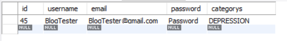
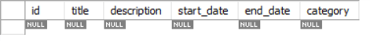
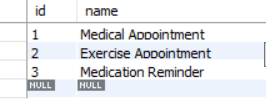

# Implementation and Design of System

## Overview of Implementations
The system was implemented in Symfony 3, a web framework designed to speed up the creation of web applications and replace
certain repetitive coding tasks.  It eliminates these coding tasks because the developer can reuse components and it can make development
less daunting for the developer by not having to redevelop basic, generic features, such as making user forms. Symfony also certain tools which can 
improve productivity for the user. The Web Toolbar Debugger being the main feature which does this. This tells the developer detailed technical information about each page and
request made on the application. This makes it easier to track errors, such as the HTTP request code. If an error is detected Symfony will return a detailed error page outlining what the error is and this will be shown in the toolbar also.
The toolbar also contains the users current credentials, the time it took the page to execute and render and the current page which is being displayed.


Symfony was installed using "Composer"[23], a tool used for dependency management in PHP. It allows the developer to declare libraries which the developers project will depend on.
Symfony was than created by issuing the command 
````
composer create-project symfony/website-skeleton:^3.4 HealthCentreIreland
````

The project also used databases made in MySQL Workbench 6.3[24]. These databases were used to store various bits of information,
be it the users info, the reminders made in the scheduler, and the messages posted. As Symfony does not provide a component which works directly with databases, the third party library Doctrine was used.

Doctrine was installed using the command 

````
composer require-doctrine
````

From here all the necessary components were installed and the project could start being worked on.

## Implementation Components

There are several components which needed to be implemented in order to provide a fully functional web application which provides its purpose.
These included;

* Database Entities.

* User Registration

* User Login

* User Calendar

* User Blog/Messaging System

* Implanting Routes based on user credentials.

### Database Entities
First databases needed to be set up which dealt with storing the users information, along with the calendar information and 
the posted messages information. To first set up the databases the parameters.yml file in the app/config folder with the database settings which are
specific to the developers environment. The parameters.yml file in this specific project looked like this.

````
parameters:
    database_host: 127.0.0.1
    database_port: 3306
    database_name: member_form
    database_user: root
    database_password: dbpassword
    mailer_transport: smtp
    mailer_host: 127.0.0.1
    mailer_user: null
    mailer_password: null
    secret: ThisTokenIsNotSoSecretChangeIt
````

Once these settings were in place the database was created using the command 

````
php bin/console doctrine:database:create
````

Once this is done the table must be created. This table was created with the title of member and the columns being the details which the user must input
at a later stage, these being; id, username, email, password and categorys. The DDL(Data Definition Language) looked like this for the setup of this table:

````
CREATE TABLE `member` (
  `id` int(11) NOT NULL AUTO_INCREMENT,
  `username` varchar(255) COLLATE utf8_unicode_ci NOT NULL,
  `email` varchar(255) COLLATE utf8_unicode_ci NOT NULL,
  `password` varchar(64) COLLATE utf8_unicode_ci NOT NULL,
  `categorys` varchar(255) COLLATE utf8_unicode_ci NOT NULL,
  PRIMARY KEY (`id`),
) ENGINE=InnoDB AUTO_INCREMENT=45 DEFAULT CHARSET=utf8 COLLATE=utf8_unicode_ci
````

Once the table  was created it looked like this:



Now that the database has been connected and setup, a Doctrine entity can be created. This
is an object with an $id property in the database. The member entity is then generated using the command:

````
php bin/console doctrine:generate:entities AppBundle
````

Once generated the entity class looks like this:

````
<?php

namespace AppBundle\Entity;

use Doctrine\ORM\Mapping as ORM;

/**
 * Member
 *
 * @ORM\Table(name="member")
 * @ORM\Entity(repositoryClass="AppBundle\Repository\MemberRepository")
 */
class Member implements UserInterface, \Serializable
{
    /**
     * @var int
     *
     * @ORM\Column(name="id", type="integer")
     * @ORM\Id
     * @ORM\GeneratedValue(strategy="AUTO")
     */
    protected $id;

    /**
     *
     * @var string
     * @ORM\Column(name="username", type="string", length=255, unique=true)
     *
     */
    protected $username;

    /**
     *
     * @var string
     * @ORM\Column(name="email", type="string", length=255, unique=true)
     *
     */
    protected $email;

    /**
     * @var string
     * @ORM\Column(name="categorys", type="string", length=255)
     */
    protected $categorys;


    protected $plainPassword;


    /**
     * @var string
     *
     * @ORM\Column(name="password", type="string", length=64)
     */
    protected $password;


    /**
     * Get id
     *
     * @return int
     */
    public function getId()
    {
        return $this->id;
    }


    /**
     * Set username
     *
     * @param string $username
     *
     * @return Member
     */
    public function setUsername($username)
    {
        $this->username = $username;

        return $this;
    }

    /**
     * Get username
     *
     * @return string
     */
    public function getUsername()
    {
        return $this->username;
    }

    /**
     * Set email
     *
     * @param string $email
     *
     * @return Member
     */
    public function setEmail($email)
    {
        $this->email = $email;

        return $this;
    }

    /**
     * Get email
     *
     * @return string
     */
    public function getEmail()
    {
        return $this->email;
    }

    /**
     * Set password
     *
     * @param string $password
     *
     * @return Member
     */
    public function setPassword($password)
    {
        $this->password = $password;

        return $this;
    }

    /**
     * Get password
     *
     * @return string
     */
    public function getPassword()
    {
        return $this->password;
    }

````

To transform this into a symfony user object on the application two interfaces must first be implemented. These two
interfaces being:

````
implements UserInterface, \Serializable
````

and:

````
use Symfony\Component\Security\Core\User\UserInterface;
````

By implementing these two interfaces more methods must be added to the Member entity. These methods being the
"getRoles()", getSalt(), and eraseCredentials() method. The getRoles() method will return an arrays of strings, these strings
being the users role within the application. For example in this web application the roles given to users are based on their registered illness, such as;
"ROLE_CANCER", "ROLE_DEPRESSION", "ROLE_DIABETES", "ROLE_ALZHEIMERS" and "ROLE_ARTHRITIS".
The getSalt() method will hash and encrypt passwords. But if a password is being hashed using bcrypt as it will be in this project
there is no need to use the salt method, and it can return null. The eraseCredentials() method will remove any sensitive data from the Member object.
The purpose of implementing the "Serializable" method is so that the user only has to log in once for a pre-determined length of time, as opposed to having
to log in every time a new request is made on the application. Creating a user and how their information is added to the database will be further explained in section 4.2.2.

Once the member table is created it is necessary to also create a table for both both the scheduler and the blog post. For the scheduler a table with all the necessary information
regarding the users set reminder must be taken into account. The table was called appointments and was given 5 fields all relating to the
reminders set by the user, these being; id, title, description, start_date, end_date and category. The DDL for the following table was;

````
CREATE TABLE `appointments` (
  `id` bigint(20) NOT NULL AUTO_INCREMENT,
  `title` varchar(255) NOT NULL,
  `description` text,
  `start_date` datetime NOT NULL,
  `end_date` datetime NOT NULL,
  `category` bigint(20) DEFAULT NULL,
  PRIMARY KEY (`id`),
  KEY `IDX_6A41727A64C19C1` (`category`),
  CONSTRAINT `FK_6A41727A64C19C1` FOREIGN KEY (`category`) REFERENCES `categories` (`id`)
) ENGINE=InnoDB AUTO_INCREMENT=38 DEFAULT CHARSET=utf8
````

Once this table has been created it looks like:



The category field is a foreign key which references another table called category. This will further be explained in section 4.2.4.
It is used to display a category in which the user can set their reminder for, being "Medical Reminder", "Exercise Reminder" and medication reminder. The DDL for this looks like;

````
CREATE TABLE `categories` (
  `id` bigint(20) NOT NULL AUTO_INCREMENT,
  `name` varchar(255) NOT NULL,
  PRIMARY KEY (`id`)
) ENGINE=InnoDB AUTO_INCREMENT=4 DEFAULT CHARSET=utf8
````

Once the table is created it looks like:



### User Registration

### User Login

### User Calendar/Scheduler

### User Blog/Messaging System

### Implementing Routes based on user credentials

## Graphical Components and User Interface

